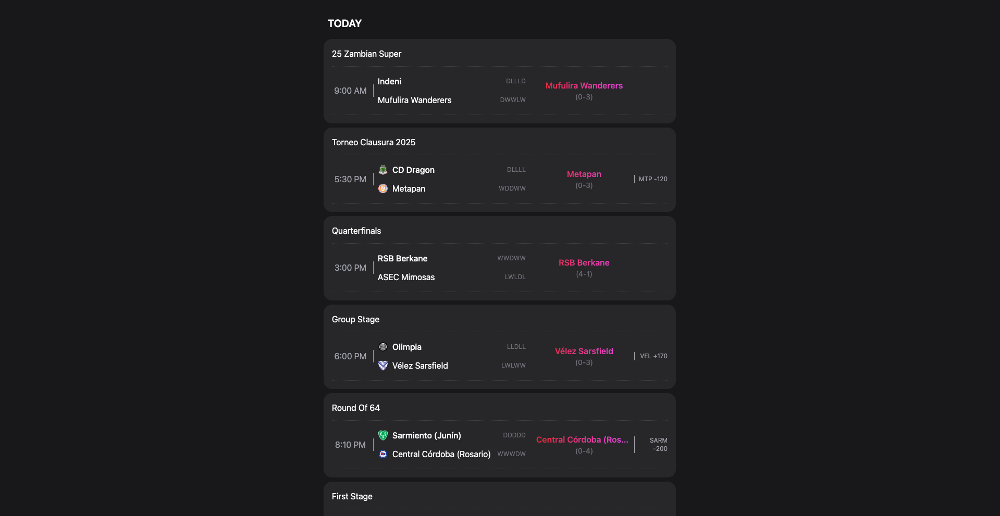

# Winner's Table

Fetches data from ESPN's hidden API endpoints for all current & next day's soccer matches & returns & displays a select list of projected winners based on certain criteria

**Link to project:** https://winners-table.netlify.app

## 🚀 How It's Made:

**Tech used:** [Astro](https://astro.build/), HTML, [Tailwind CSS](https://tailwindcss.com/), JavaScript

## 🧞 Commands

All commands are run from the root of the project, from a terminal:

| Command                   | Action                                           |
| :------------------------ | :----------------------------------------------- |
| `npm install`             | Installs dependencies                            |
| `npm run dev`             | Starts local dev server at `localhost:4321`      |
| `npm run build`           | Build your production site to `./dist/`          |
| `npm run preview`         | Preview your build locally, before deploying     |
| `npm run astro ...`       | Run CLI commands like `astro add`, `astro check` |
| `npm run astro -- --help` | Get help using the Astro CLI                     |
